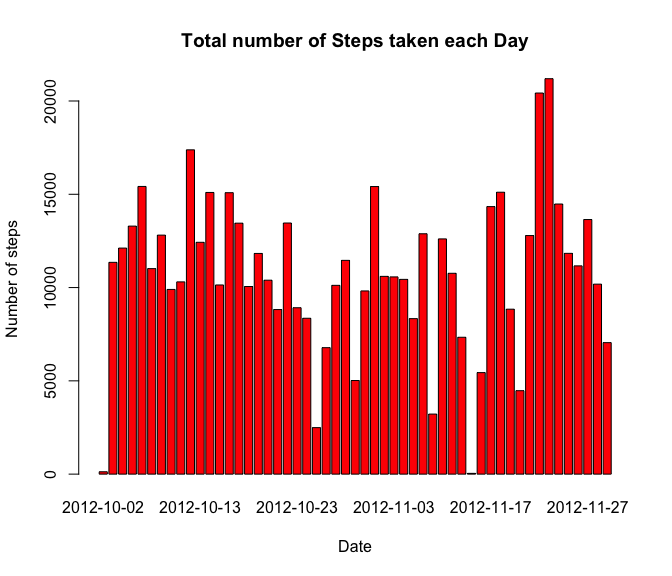
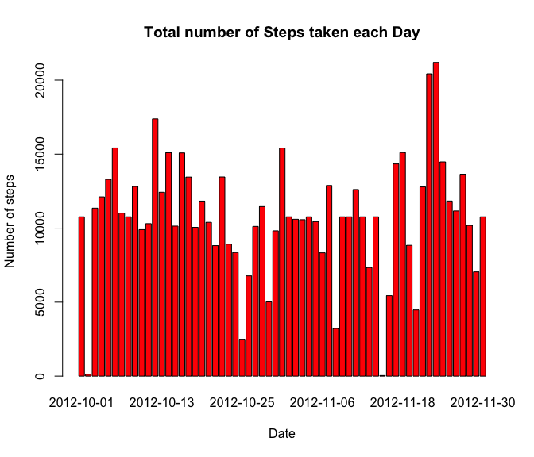
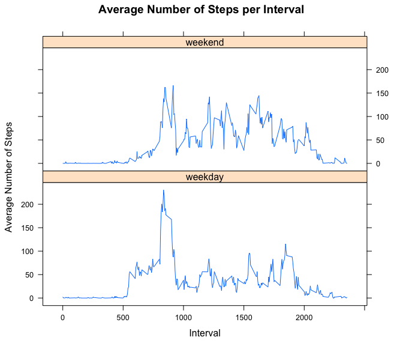

# Reproducible Research: Peer Assessment 1
Koushik Pal  

This is the first Peer Assessment project in the Reproducible Research module of the Johns Hopkins Data Specialization Track. The goal is to write a report that answers the questions detailed below. Ultimately, it is required to complete the entire assignment in a single R markdown document that can be processed by knitr and be transformed into an HTML file.


## Global Setup

Throughout your report make sure you always include the code that you used to generate the output you present. When writing code chunks in the R markdown document, always use `echo = TRUE` so that someone else will be able to read the code. This assignment will be evaluated via peer assessment. So it is essential that your peer evaluators be able to review the code for your analysis.

```r
library(knitr)
opts_chunk$set(echo=TRUE)
```


## Loading and preprocessing the data

1. Load the data (i.e. `read.csv()`)

```r
unzip('activity.zip')
data <- read.csv('activity.csv')
str(data)
```

```
## 'data.frame':	17568 obs. of  3 variables:
##  $ steps   : int  NA NA NA NA NA NA NA NA NA NA ...
##  $ date    : Factor w/ 61 levels "2012-10-01","2012-10-02",..: 1 1 1 1 1 1 1 1 1 1 ...
##  $ interval: int  0 5 10 15 20 25 30 35 40 45 ...
```

2. Process/transform the data (if necessary) into a format suitable for your analysis

```r
# The date variable is a factor. So we transform it to date format.
data$date <- as.Date(data$date, format='%Y-%m-%d')
str(data)
```

```
## 'data.frame':	17568 obs. of  3 variables:
##  $ steps   : int  NA NA NA NA NA NA NA NA NA NA ...
##  $ date    : Date, format: "2012-10-01" "2012-10-01" ...
##  $ interval: int  0 5 10 15 20 25 30 35 40 45 ...
```


## What is mean total number of steps taken per day?
For this part of the assignment, you can ignore the missing values in the dataset.

1. Make a histogram of the total number of steps taken each day

```r
total_steps_day <- aggregate(steps ~ date, data, sum)
barplot(total_steps_day$steps, names.arg=total_steps_day$date, main='Total number of Steps taken each Day', 
                                                               xlab='Date', ylab='Number of steps', col='red')
```

 

2. Calculate and report the mean and median total number of steps taken per day

```r
mean_median <- c(mean = mean(total_steps_day$steps), median = median(total_steps_day$steps))
mean_median
```

```
##     mean   median 
## 10766.19 10765.00
```


## What is the average daily activity pattern?
1. Make a time series plot (i.e. `type = 'l'`) of the 5-minute interval (x-axis) and the average number of steps taken, averaged across all days (y-axis)

```r
mean_steps_interval <- aggregate(steps ~ interval, data, mean)
plot(mean_steps_interval$interval, mean_steps_interval$steps, type='l', main='Average Number of Steps per Interval',
                                                                        xlab='Interval', ylab='Average Number of Steps')
```

 

2. Which 5-minute interval, on average across all the days in the dataset, contains the maximum number of steps?

```r
max_interval_location <- which.max(mean_steps_interval$steps)
mean_steps_interval[max_interval_location,1]
```

```
## [1] 835
```
The 5-minute interval containing the maximum number of steps on average is 835.


## Imputing missing values
Note that there are a number of days/intervals where there are missing values (coded as `NA`). The presence of missing days may introduce bias into some calculations or summaries of the data.

1. Calculate and report the total number of missing values in the dataset (i.e. the total number of rows with `NA`s)

```r
sum(!complete.cases(data))
```

```
## [1] 2304
```

2. Devise a strategy for filling in all of the missing values in the dataset. The strategy does not need to be sophisticated. For example, you could use the mean/median for that day, or the mean for that 5-minute interval, etc.


```r
# I use the strategy of replacing the NA values by the mean for the corresponding 5-minute interval.
```

3. Create a new dataset that is equal to the original dataset but with the missing data filled in.

```r
new_data <- transform(data, steps=ifelse(is.na(data$steps), 
                                        mean_steps_interval$steps[match(data$interval, mean_steps_interval$interval)], 
                                        data$steps))
sum(!complete.cases(new_data))
```

```
## [1] 0
```

4. Make a histogram of the total number of steps taken each day

```r
new_total_steps_day <- aggregate(steps ~ date, new_data, sum)
barplot(new_total_steps_day$steps, names.arg=new_total_steps_day$date, main='Total number of Steps taken each Day', 
                                                                       xlab='Date', ylab='Number of steps', col='red')
```

 

Calculate and report the mean and median total number of steps taken per day. 

```r
new_mean_median <- c(mean = mean(new_total_steps_day$steps), median = median(new_total_steps_day$steps))
new_mean_median
```

```
##     mean   median 
## 10766.19 10766.19
```

Do these values differ from the estimates from the first part of the assignment? What is the impact of imputing missing data on the estimates of the total daily number of steps?

```r
difference <- new_mean_median - mean_median
difference
```

```
##     mean   median 
## 0.000000 1.188679
```
As is clear from the values above, the new estimates are almost the same as the old estimates.


## Are there differences in activity patterns between weekdays and weekends?
For this part the `weekdays()` function may be of some help here. Use the dataset with the filled-in missing values for this part.

1. Create a new factor variable in the dataset with two levels – “weekday” and “weekend” indicating whether a given date is a weekday or weekend day.

```r
week_days <- c('Monday', 'Tuesday', 'Wednesday', 'Thursday', 'Friday')
new_data$day_type <- ifelse(weekdays(new_data$date) %in% week_days, 'weekday', 'weekend')
head(new_data)
```

```
##       steps       date interval day_type
## 1 1.7169811 2012-10-01        0  weekday
## 2 0.3396226 2012-10-01        5  weekday
## 3 0.1320755 2012-10-01       10  weekday
## 4 0.1509434 2012-10-01       15  weekday
## 5 0.0754717 2012-10-01       20  weekday
## 6 2.0943396 2012-10-01       25  weekday
```

2. Make a panel plot containing a time series plot (i.e. `type = 'l'`) of the 5-minute interval (x-axis) and the average number of steps taken, averaged across all weekday days or weekend days (y-axis).

```r
library(lattice)
new_mean_steps_interval <- aggregate(steps ~ interval + day_type, new_data, mean)
xyplot(new_mean_steps_interval$steps ~ new_mean_steps_interval$interval | new_mean_steps_interval$day_type, 
       type='l', main='Average Number of Steps per Interval', xlab='Interval', ylab='Average Number of Steps', layout=c(1, 2))
```

 

